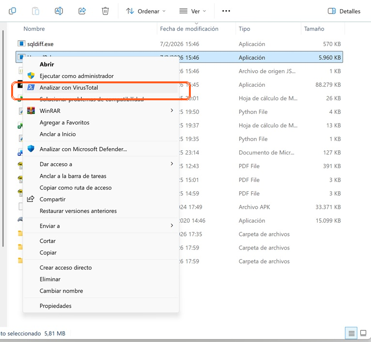
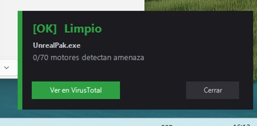
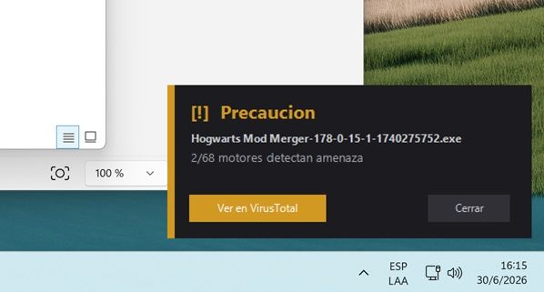
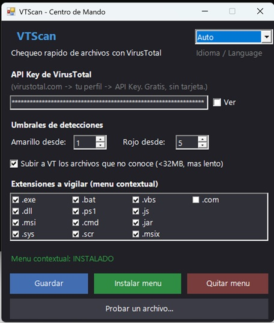
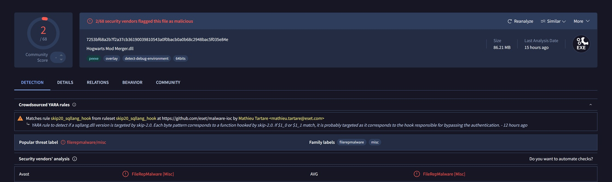

# VTScan

🌐 [English](README.md) · **Español**

> Chequeá cualquier archivo descargado con **VirusTotal** desde el menú contextual de Windows. Click derecho → semáforo 🟢🟡🔴 en una notificación. Sin abrir el navegador, sin subir tu archivo.


---

## ¿Qué es?

Bajaste un `.exe`, un `.msi`, un instalador de cualquier lado y antes de hacer
doble click querés una segunda opinión rápida. **VTScan** agrega una opción al
menú contextual de Windows:

> 🛡️ **Analizar con VirusTotal**

Te devuelve, en una notificación con color, cuántos de los ~70 motores antivirus
de VirusTotal detectan el archivo como amenaza:

| Color | Significado |
|:---:|---|
| 🟢 **Limpio** | 0 detecciones |
| 🟡 **Precaución** | pocas detecciones (revisá cuáles antes de confiar) |
| 🔴 **PELIGRO** | varias detecciones — no lo ejecutes hasta investigar |

## Así se ve

Click derecho sobre cualquier ejecutable → **Analizar con VirusTotal**:



En segundos, una notificación con el semáforo:

| 🟢 Limpio (0/70) | 🟡 Precaución (2/68) |
|:---:|:---:|
|  |  |

## ¿Por qué es distinto?

- **No sube tu archivo.** Calcula el hash **SHA-256** localmente y le pregunta a
  VirusTotal si ya tiene un reporte de ese hash. Es instantáneo, privado y no
  gasta tu cuota subiendo nada. (La subida de archivos desconocidos es opcional
  y la activás vos.)
- **No abre el navegador** para el chequeo rápido: la respuesta llega como una
  notificación. Si querés el detalle, un botón te abre el reporte completo.
- **Sin permisos de administrador.** Todo se instala en tu usuario (`HKCU`) y se
  desinstala con un click.
- **Bilingüe (Español / English).** La interfaz se adapta al idioma de Windows, o
  lo elegís a mano en el Centro de Mando.
- **Tu API Key nunca queda en el repo.** Vive en `%APPDATA%\VTScan\config.json`,
  fuera del código.

## Requisitos

- Windows 10 / 11 (PowerShell viene de fábrica).
- Una **API Key gratuita** de VirusTotal:
  registrate en [virustotal.com](https://www.virustotal.com), entrá a tu perfil
  → **API Key**. No pide tarjeta. El plan free da ~4 consultas/min y 500/día,
  de sobra para uso personal.

## Instalación

1. Descargá este repositorio
   (botón verde **Code → Download ZIP**, o `git clone`).
2. Click derecho en **`VTScan-CommandCenter.ps1`** → *Ejecutar con PowerShell*.
   > Si Windows lo bloquea, abrí PowerShell en la carpeta y corré:
   > `powershell -ExecutionPolicy Bypass -File .\VTScan-CommandCenter.ps1`
3. Pegá tu **API Key** → **Guardar**.
4. **Instalar menú**. ¡Listo!

Ahora, botón derecho sobre cualquier ejecutable → **Analizar con VirusTotal**.

## Centro de Mando

`VTScan-CommandCenter.ps1` es la interfaz de configuración:



Te deja:

- Cargar / cambiar la **API Key**.
- Elegir el **idioma** (Auto / Español / English).
- Ajustar los **umbrales** (desde cuántas detecciones es 🟡 o 🔴).
- Elegir **qué extensiones** aparecen en el menú (`.exe`, `.dll`, `.msi`, `.sys`,
  `.bat`, `.ps1`, `.cmd`, `.scr`, y más).
- Activar la **subida automática** de archivos que VT no conoce (<32 MB).
- **Probar un archivo** al instante, sin instalar nada.
- **Instalar / quitar** el menú contextual.

> Al cambiar el idioma, reabrí el Centro de Mando para verlo aplicado y volvé a
> tocar **Instalar menú** para actualizar el texto del menú contextual.

## ¿Cómo leer el resultado?

Un número bajo no siempre es malware: el software de nicho (mods de juegos,
emuladores, herramientas viejas) suele dar **falsos positivos**.

- 🟢 **0** → tranquilo.
- 🟡 **1–4** → mirá *qué* motores lo marcan con el botón "Ver en VirusTotal".
  Si son antivirus menores con nombres genéricos (`Trojan.Generic`,
  `ML.Attribute...`), casi siempre es ruido.
- 🔴 **5+**, sobre todo si coinciden pesos pesados (Microsoft, Kaspersky, ESET,
  BitDefender) → no lo ejecutes hasta investigar bien.

El botón **"Ver en VirusTotal"** abre el reporte completo: qué motores lo marcan,
con qué nombre y por qué. En este ejemplo, el 2/68 eran detecciones heurísticas
(`FileRepMalware`) de antivirus menores — el patrón típico de un falso positivo:



> VTScan **no reemplaza a un antivirus**. Es una segunda opinión rápida antes de
> ejecutar algo.

## ¿Cómo funciona por dentro?

```
Click derecho → "Analizar con VirusTotal"
        │
        ▼
  SHA-256 del archivo (local, no se sube nada)
        │
        ▼
  GET api/v3/files/{hash}  ──►  VirusTotal
        │
   ┌────┴─────────────┐
   ▼                  ▼
 conocido         404 (desconocido)
   │                  │
 semáforo       opcional: subir <32MB
                       │
                 poll del análisis
                       │
                  ▼  semáforo
```

## Estructura del proyecto

| Archivo | Qué hace |
|---|---|
| `VTScan.Core.ps1` | Motor: config, idiomas, hash, consulta a VT, popup, registro del menú. |
| `VTScan.ps1` | Punto de entrada que dispara el menú contextual. |
| `VTScan-CommandCenter.ps1` | Interfaz gráfica de configuración. |
| `config.example.json` | Ejemplo de configuración. |

## Privacidad y seguridad

- Tu API Key se guarda en `%APPDATA%\VTScan\config.json`, **nunca** en el repo
  (el `.gitignore` ya lo cubre).
- En el chequeo por hash **no se transmite el archivo**, sólo su huella SHA-256.
- El código es PowerShell plano: podés leer exactamente qué hace.

## Licencia

[MIT](LICENSE) — usalo, modificalo y compartilo libremente.
